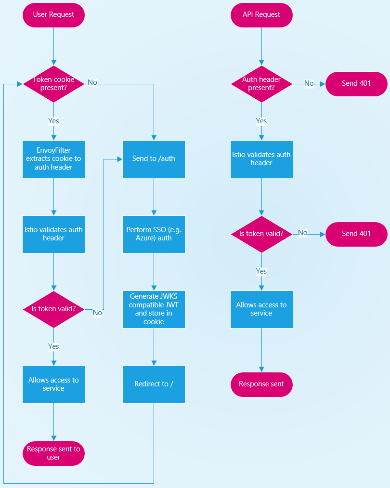

# Istio and JWT authentication

I’ve been looking at a workflow which allow the [JWT authentication](https://istio.io/latest/docs/tasks/security/authorization/authz-jwt/) in Istio to be used for both UI and API requests. The basic idea is to make use of Istio’s JWT authentication mechanism to control initial access and then use an authorization policy to control access to specific services.

The diagram below shows the basic workflow of how this will work. It has been simplified by removing things like refresh tokens or authorization policies.

The basic idea is that once the basic auth is done to a 3rd party service such as Azure AD/Entra ID or Google Workspace, a signed token is generated and stored in a cookie. This cookie value is then used for further auth requests. For APIs, the cookie value can be used directly and passed to any API calls. For UIs, because Istio can’t currently extract tokens from, an Envoy Filter is used. This looks for a specific cookie and copies the value to the authentication header before forwarding the request to Istio’s authentication handler.

If the token is valid (signed by a known private key and hasn’t expired), traffic is allowed to pass (subject to authorization policies) or rejected. On unauthorised requests, APIs just respond as unauthorised where as the UI redirects to the `/auth` page.