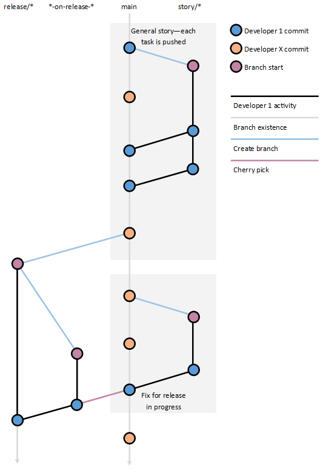

# Trunk-based development with release branches

***I would no longer advocate this approach, in favour of releasing from trunk directly.  For my latest thinking, please see my [engineering approach article](2024-04-24-Engineering-approach.md).***

There are many ways to develop software and different ways to use branches within that workflow. This article outlines one such approach which is centred around trunk-based development with release branches to get code out to production.

This is not true continuous delivery but does allow a good balance to be achieved between continuous integration and planned deliveries, particularly for teams or projects without the automated testing in place to support a true CI/CD pipeline.

For the purposes of this article, Azure DevOps will be used when a specific platform is referenced regarding version control and deployment pipelines.

This article will be updated (and republished if appropriate) as the process evolves. It is being published now as a starting point and to share ideas.

## Environments

For this article, the assumption is that four environments are in play; local development, an integration environment and a blue/green staging and production environment. For the most part and for the purposes of this article, a separate staging and production environment setup will work just the same.

## Branches

There will be four types of branches used in this model:

- `main`
- `story/*`
- `release/*`
- `*-on-release-*`

### Branch Protection

It is recommended that very few people can directly push to `main` or a `release/*` branch (anyone should be able to create the latter though). It’s also recommended that self approving PRs are disabled.

### Branch Overviews

This section provides a summary of the different branches that are expected within this workflow.

#### main
The main branch is deployed to the development environment and should be regularly* getting updated with the latest code changes. Any code committed to this branch should be releasable with new features that shouldn’t be available on production protected using feature flagging. This branch should be protected from direct changes.

* No code should be in a branch outside main that is older than a day – stories or tasks should be small enough to support this

#### story/* (or task/* or hotfix/* or bug/*)

These branches should be short lived and regularly pushed to main (I recommend using pull requests). If working on a story that will take longer than a day it would make sense to have a branch last longer than a day but regular merges to main should still be happening.

#### release/*

These branches are created from the main branch and will trigger a push to a staging environment. If a problem is found, changes shouldn’t be made directly to the release branch but should be made against main (via a story branch and a pull request) and then a cherry pick pull request made to the release branch. These branches should be protected by direct changes.

Once a release to production is completed successfully, these branches could be deleted but it may be preferred to keep at least some of these branches for references (perhaps the latest three branches) in case an issue occurs.

The naming format of the part after release can be anything as long as it’s unique per release. If daily or less frequent releases are being done, release/yyyyMMdd could be used (e.g. `release/20221017`). Alternatively, a major.minor.revision approach can be taken.

#### *-on-release-*

These branches only come into play when a cherry pick is needed from main to a release branch. The naming format used here is the one that Azure DevOps uses when using the cherry pick functionality (accessible by the three-dot/kebab menu) on a commit’s details page. Once the target branch (i.e. a release/* branch) is selected, the default topic branch name is populated and will look something like `79744d39-on-release-20221017`.

### Branching Workflow Example

The following example doesn’t highlight origin vs local versions of branches with the assumption being that any local branches are kept up to date. A good approach for this is rebasing the child branch to the parent branch and then, for story branches, using a forced push to origin from local using `git push -f`. If more than one engineer is working on a story branch, this approach will likely cause issues and isn’t recommended. Whilst multiple engineers working on a story is fine, they probably shouldn’t be working on the same story branch (e.g. one does API, one does UI).

## Code Quality and Testing

For trunk-based development to work well, it’s essential that there is confidence in the quality of the code being merged into the main branch and potentially released at any time.

There are several tools and processes that can be used to improve code quality and improve release confidence including:

- Pull requests
- Comprehensive unit testing
- Test Driven Development
- Behaviour Driven Development
- Regression Testing

In the following sections, each of these topics will be covered.

### Pull Requests

When code is being merged into the main branch or, when a cherry pick is needed into a release branch via a `*-on-release-*` branch, a pull request should be used. This gets a second pair of eyes on the code but also should have branch policies in place that trigger a build and run any unit tests before allowing the merge to complete.

Things to look for in a pull request include but are not limited to:

- Missing or incomplete unit testing
- Where required, feature flag not in place
- "Code smells" – code written in a ways that is not good practice and/or may be detrimental to performance, security, etc…
  - Hard coded values
  - Redundant code
  - Non-compliance with SOLID, DRY, etc…
- Not meeting the requirements of the story, task, etc…
- Microservice code written in a tightly coupled way
- Circular references
- Legal requirements not met e.g. accessibility, cookie compliance, etc…

Some of these may be validly missing from code (e.g. requirement covered by another task, cookie banner is another story, etc…) but remember the code that is approved should be releasable so, if unit testing shouldn’t be missing in most cases and, for incomplete features, a feature flag should likely be in place.

### Unit Tests

Having unit tests for your code is a good idea for (at least) two reasons:

1. You can have confidence when making changes to code that existing functionality hasn’t been broken
2. Your test confirms your code does what you think it does

Code coverage is used to measure how much of your code is covered by unit testing. A good minimum level is 80% although in some situations, a higher level may be advised.

### Test Driven Development (TDD)

The TL;DR version of this is write the tests before the code with the idea being the requirement is written before the implementation. TDD uses a red, green, refactor approach which means a test is written which fails (because there is no implementation), then the implementation is written to make the tests pass and then the code is refactored to get rid of “code smells”, etc… If gaps in the tests are noted, they should be filled, once again using the red, green, refactor approach.

Some YouTube videos on the subject are available from [Continuous Delivery](https://www.youtube.com/watch?v=yfP_v6qCdcs) and [JetBrains](https://www.youtube.com/watch?v=Jz-lg-gwc-0).

### Behaviour Driven Development (BDD)

BDD is intended to provide clear, human readable, requirements to the engineers that can be translated directly into runnable tests. Doing this using TDD is recommended. If using Visual Studio and .NET, [Specflow](https://specflow.org/) is one of the most popular choices.

Requirements are written in the form of Given… When… Then… statements to define a requirement. For example:

**Given** a user is authenticated and authorised 
**When** they visit the landing page 
**Then** they are automatically redirected to the main dashboard

### Regression Testing

This kind of testing is about making sure a site as a whole works and is often done with manual testing or automated using tools/frameworks like Selenium or Playwright.

Ideally, especially when running automated testing, these should be run against a clean environment that is spun up for the purposes of testing to guarantee a fixed starting point and to help reduce the brittleness often inherit in automated regression testing. This would include all code, databases and other services. A full dataset may not be required and, if testing against a large dataset, may not be cost or time efficient.

## Pipelines

A key part of any CI/CD setup is the pipeline(s) used to build and deploy the application. My preferred approach is a templated one as it helps:

- Minimise repetition
- Allow for a single application configuration file
- Use of scripting languages (e.g. PowerShell Core and Bash) to minimise tying to a specific platform (i.e. Windows or Linux) or pipeline technology (i.e. Azure Pipelines, Octopus, etc…)
- Use of Helm for Kubernetes deployments