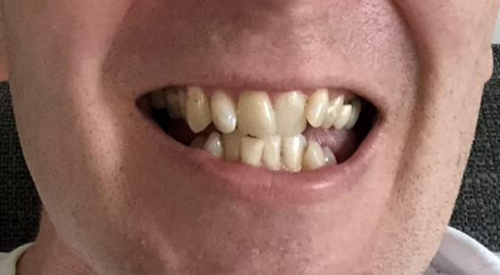
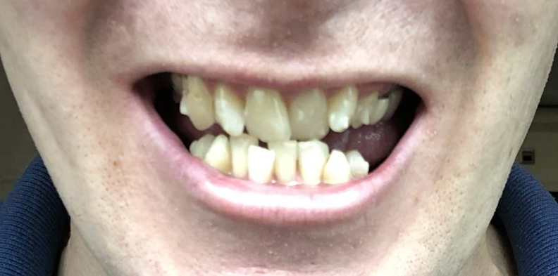
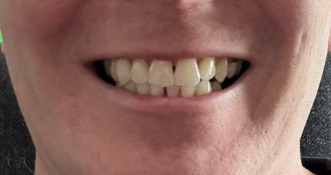

# Teeth Straightening

Back in 2023, I dedcided to get my teeth straighened.  I did this for a couple of reasons:

1. Let's be honest, it looks better!
2. Straighter, non-overlapping teeth are easier to clean and maintain, which makes my life easier and helps keep the dentist bills down!

A few friends had recently been going through the process and were using [Invisalign](https://www.invisalign.co.uk/) and, given my dentist was a provider, I decided to go with them too.

The process was as follows:

1. Initial consultation with the dentist to discuss the process and get prices
2. Initial scan of my teeth to create a 3D model and show a simulation of the potential end result (this cost about £350)
3. A few weeks later, I had a follow-up appointment to discuss the simulation and decide if I wanted to proceed, which I obviously did - total cost was about £4,000
4. I had an initial 29 week run and then a subsequent 14 week run with the option of more phases if I wanted to do some more "tweaking"
5. You then wear the retainers for a further few months to help the teeth settle into their new positions before switching to only wearing them at night
6. As part of the "package", you also get an included whitening treatment which you do once you get the retainers

## The results

### Before

### Week 2

This was taken shortly after starting, i.e. when the attachments were first attaching to my teeth.  This photo shows the bottom tooth's overlapping more too.

### After

## Pros and Cons

### Pros

- Once you sign up, you don't pay any more - i.e. you're not paying for one round of aligners, you're paying for the whole process, however many rounds that takes
- You can take them out to eat, drink and clean your teeth, which is a lot easier than braces
- They are far less visible than braces - most people didn't even notice I was wearing them

### Cons

- Retainers are a just the same as the aligners - due to the extremely tight fit, the lower aligner from my first set broke due to plastic fatigue of taking them out
- Replacement retainers - sold as a pack of 3 pairs - are about £350, which is a lot for basically hitting print on a printer!
- At week 15 of the initial set of aligners, I raised concerns that certain teeth hadn't moved as expected (i.e. based on the aligners I was wearing) but the decision was made to continue until the end of the set, rather than adjusting the aligners
  - This decision is probably the only reason the extra 14 weeks were needed as the only thing really being "fixed" in that second set were the two teeth I'd pointed out at week 15

## Conclusion

I am very pleased with the overall result but a review and refinement half way though would improve the process.  Also, reducing the cost of replacement retainers would be a good idea too, even if it means same price but more than 3 pairs.